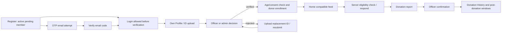
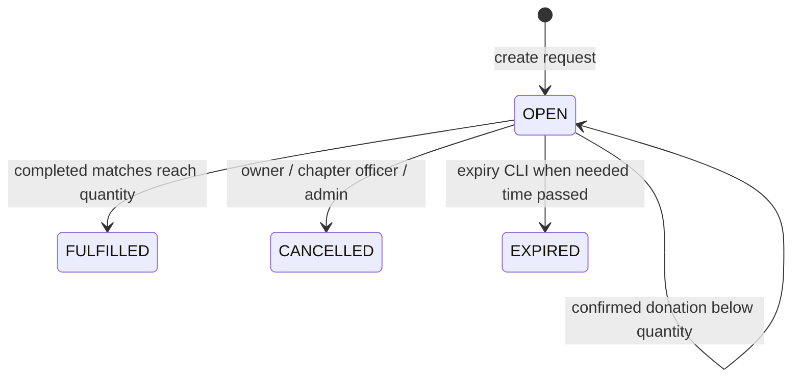
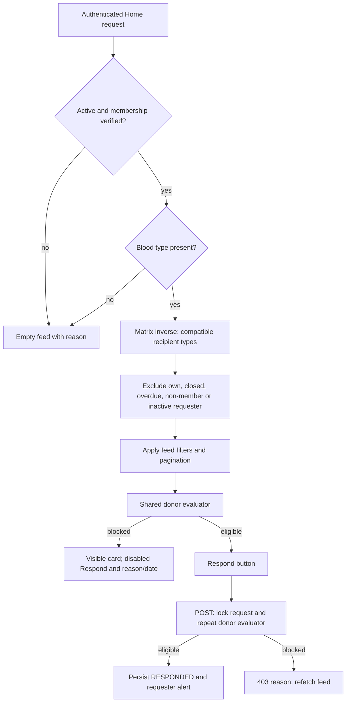
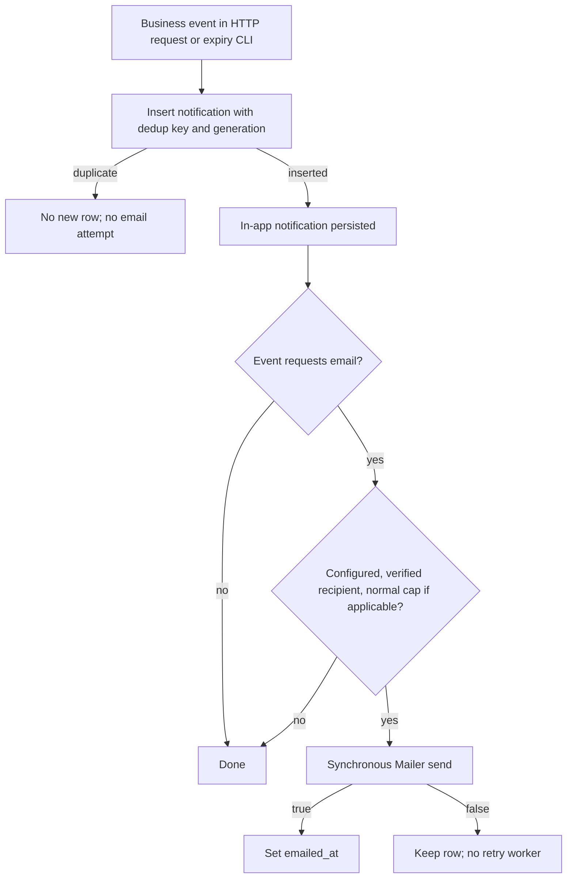
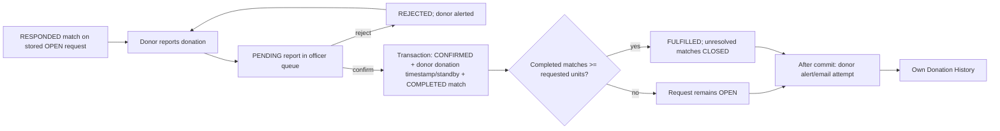

# BloodMatch Flow, Safety, and Notification Audit

Audit date: 2026-10-08 (Asia/Manila). Search marker: `BM-FLOW-SAFETY-AUDIT-2026-10-08`.

## 1. Executive Summary

BloodMatch has a connected registration, verification, request, donor-response, donation-report, and officer-confirmation implementation. Home uses centralized blood compatibility and live server-side donor eligibility. Matching includes compatible substitute types, not just exact blood types. Protected staff APIs enforce roles and chapter scope independently of navigation.

The full requirements baseline is not satisfied. Non-response standby after 42 hours is absent; the existing 42-hour interval starts after a confirmed donation. Matching ranks chapters and distance but does not filter potential donors by chapter/municipality or execute biological substitution tiers. Notifications cover only some transitions, email is synchronous and best-effort, and downloadable reports are absent. Expiry has a CLI implementation but no verified scheduler. Several lifecycle mutations have read-before-write race windows.

**FR-01 through FR-22 totals: IMPLEMENTED 1 | PARTIAL 16 | MISSING 2 | UNVERIFIED 3.** These totals count only the 22 rows in section 15, not every rule or notification row.

Method and limits:

- Baseline: [.agents/requirements/BloodMatch_System_Requirements_and_Features.md](../.agents/requirements/BloodMatch_System_Requirements_and_Features.md), including its definition of done and approved active-member Demand Map access. Older FR numbering is not used.
- Read frontend, API routes, controllers, services, repositories, migrations/seeds, related tests, and relevant documentation. Schema and seed files establish intended structure/defaults, not deployed database contents.
- Executed only offline Node checks: `node tests/home_ui.mjs`, `node tests/auth_cache_static.mjs` (6 checks), and `node tests/request_ui_static.mjs` (14 checks). All passed. Home rendered-component checks passed. These demonstrate static/rendered behavior only, not clicks, network integration, persistence, timing, or delivery.
- No PowerShell test suite, PHP/database test, seed, migration, expiry job, live API, SMTP operation, or database query was executed. No environment file was read or changed. No commit was made.
- Source-proven rules are distinguished from deployed execution. Runtime database constraints, SMTP delivery, installed scheduler, server storage exposure, encryption, browser/mobile behavior, latency, and uptime remain UNVERIFIED. A historical PASS log is not a fresh verification.
- Only this new report is authorized as an exception to the read-only instruction. No fixes are implemented.

## 2. System Flow Overview

Common path: React component -> `frontend/src/services/apiClient.js` (session cookie and CSRF header) -> `backend/public/index.php` (headers, CORS, CSRF) -> [API routes](../backend/routes/api.php) -> controller authorization -> service business rules -> PDO repositories/MySQL. There is no separate ORM layer.

### Member Flow

Register -> receive email OTP -> verify email -> login -> upload/review National ID -> verified membership -> edit own profile/location -> enroll as donor -> browse compatible Home requests -> respond -> report donation -> officer decision -> own history. Email verification and membership verification are separate states; login does not require either to be complete.

### Requester Flow

Email-verified active pending/verified account -> shared create modal -> OPEN request (pending membership adds `pending_review`) -> candidate matches persisted -> in-app alerts / creation-time emergency emails -> requester reads potential/responding donors -> edits/cancels or waits for donation confirmations -> FULFILLED when completed matches meet quantity. CLI execution can change overdue OPEN requests to EXPIRED.

### Donor Flow

Verified active member -> age/consent enrollment check -> `donor_enrolled_at` and `available` -> compatible request -> eligibility re-check -> RESPONDED match -> optional withdraw -> PENDING donation report -> officer confirms/rejects -> COMPLETED on confirmation, donor stored as standby. Eligibility is lazily recalculated from confirmation time and settings.

### Officer Flow

`/officer/dashboard` -> chapter statistics -> `/officer/verifications` and protected document review -> approve/reject member -> `/officer/confirmations` -> confirm/reject reports associated with chapter requests -> chapter audit logs, analytics, demand aggregates. Member-list API exists; no dedicated member-management page is registered in the current app.

### Admin Flow

`/admin/dashboard` -> global statistics -> `/admin/verifications`, `/admin/analytics`, `/admin/demand-map`, `/admin/audit-logs`. Admin-only APIs manage user role/chapter/deactivation/reactivation. Donation decision APIs also accept admins, but the current admin router lacks a dedicated confirmations page. Chapter/configuration mutation APIs are not registered.

## 3. Member Journey

API paths below are relative to the site. Sources are linked to actual files; function names identify the relevant code where a line is not supplied.

| Step / user action and UI | API | Backend / repository / persistence | Validation and authorization | Notifications | Failure / empty state |
|---|---|---|---|---|---|
| Registration wizard, ID and privacy acknowledgment; `RegisterPage`, `/register` | `POST /api/register`; `GET /api/chapters` | `RegisterController` -> [AuthService::register](../backend/src/Services/AuthService.php#L51) -> `UserRepository::create`; `users` active/member/pending, bcrypt password, no email verification; optional `member_documents`; audit | Required names/email/password/DOB/chapter/privacy; chapter existence; 8-72 character password with letter/number; uniqueness; document MIME/size at storage | OTP email attempt; optional ID upload alerts active admins in-app | Field errors, duplicate email 409, upload failure. User is created before OTP/document processing; late failure can return error with account already persisted. No encompassing transaction |
| OTP dialog during registration/Home; `EmailVerificationDialog` | `POST /api/auth/verify`, `/api/auth/verify/resend` | `EmailVerificationController`; `users.email_code_hash`, expiry, verified timestamp; `auth_throttle`, audit | Code bcrypt hash, 10-minute TTL; verify account/IP throttles; resend 60-second cooldown and account limit; generic invalid/resend responses | Code email only; no in-app OTP | Invalid/expired 400, throttled 429; missing SMTP/send failure still produces ordinary success flow. No post-verification donor reconciliation call |
| Login on public `LandingPage`, `/`; `AuthContext` | `POST /api/login`, `GET /api/auth/me`, `POST /api/logout` | [AuthService::login](../backend/src/Services/AuthService.php#L176), `UserRepository`, `Session`; `auth_throttle`, audit, PHP session | Password verification; 5 failures/15-minute lock; deactivated login blocked; regenerated session; `/auth/me` requires active user | None found for login/logout | Invalid 401, deactivated 403, lock 429. Auth refresh failure clears client identity/cache. Pending/unverified-email login remains allowed |
| Account verification from own `ProfilePage`, `/profile` | `POST /api/profile/documents`; `GET /api/profile/documents`; protected file route; `POST /api/profile/resubmit` | `DocumentController`, `DocumentStorageService`, `DocumentRepository`; rejected ID upload invokes `VerificationService::resubmit`; review writes `users.verification_status`, `verification_decisions`, audit | Active account; privacy acknowledgment, document type allow-list, 5 MB MIME check; verified National ID uploads locked; member resubmission only after rejection; approval requires ID; no self-decision | Admin upload alert; resubmission acknowledgment; approved/rejected member alert + normal email attempt | Upload errors/413/429; approval missing ID 409; rejection reason required. Multiple decision writes are not one transaction |
| Own profile edit/picture/location, `ProfilePage` | `GET/PUT /api/profile`; `POST /api/profile/picture`; location lookup endpoints | [ProfileController](../backend/src/Controllers/ProfileController.php), `UserRepository`, `ProfilePictureStorageService`; users allow-listed profile fields; location reference resolves coordinates; audit | Active self; forbidden role/status/email/password/verified-blood fields rejected; names/phone/DOB/blood validated; direct coordinates rejected | No profile-update alert found; blood/location change reconciles donor opportunities | Validation errors; lookup/picture failures. Own profile query also loads requests/history; failure of either can fail whole page load |
| Donor enrollment, own Profile | `POST /api/profile/enroll-donor` | [ProfileController::enrollDonor](../backend/src/Controllers/ProfileController.php#L175), `AgeEligibilityService`, documents; users enrollment timestamp + available; donor match refresh; audit | Active verified member; under 16 blocked, 16-17 needs consent on file, adult allowed; idempotent already enrolled. Email verification not required for enrollment | In-app opportunity alerts if eligible after refresh; no enrollment confirmation alert | Enrollment 409 for age/consent/verification; missing blood/email may allow enrollment but prevent responses |
| Availability menu, `App.jsx` | `POST /api/profile/donor-availability` | `DonorEligibilityService::assertAvailabilityChangeAllowed`; users availability; audit; refresh latest 100 current requests | Active enrolled account, only available/unavailable input, post-donation windows block changes. This endpoint does not itself check member role or membership/email verification | Opportunity refresh can alert; no availability-change alert found | 409 with timing details. Menu offers toggle during cooldown and displays backend error rather than disabling for the window |
| Home, `/`, `HomeFeedPage` + `FeedCard` | `GET /api/home-feed` | `RequestsController::homeFeed` -> compatibility inverse -> `BloodRequestRepository::pageCompatibleOpenForViewer` -> donor eligibility -> safe response DTO; read only | Authenticated; active + membership verified + blood type for nonempty feed; own/closed/overdue/incompatible requests excluded | None on reading; notification unread polling is separate | Loading, API/retry error, unavailable reason, no compatible requests, filtered-empty and Load more states |
| Home Respond / Matches I can help | `POST /api/requests/{id}/respond`; legacy `POST /api/matches/{matchId}/respond` | [MatchResponseService::respond](../backend/src/Services/MatchResponseService.php#L16); transaction request lock + match lock; inserts/updates RESPONDED; unique request/donor; audit; requester notification | Authenticated actor loaded from DB; full eligibility check; legacy route checks match donor ownership | Requester in-app; emergency requester email after commit | Eligibility 403, missing 404, completed 409, failed transaction 500. Home responds immediately; Matches asks confirmation |
| Match details, `MatchesPage`, `/requests/:id/matches` | `GET /api/requests/{id}/matches` | `RequestsController::matches`, `MatchService::privacySafeMatches`; safe request and match DTOs | Owner/admin/chapter officer sees full permitted donor list; matched donor sees own match only; compatible verified browser sees request and empty list | None on reading | No eligible donors, request access 403/404. Browser without persisted match cannot respond from this page although Home/API can |
| Withdraw offer on Matches | `POST /api/matches/{matchId}/withdraw` | `MatchesController::withdraw`; RESPONDED -> NOTIFIED; audit | Active owner; request OPEN, match RESPONDED, no pending report. No atomic lock/check/write | No requester withdrawal alert found | 409 for inactive request, wrong match state or pending report; confirmation UI and error state |
| Report donation on Matches | `POST /api/donation-reports` | [DonationService::submit](../backend/src/Services/DonationService.php#L17); `DonationReportRepository`; PENDING report + audit | Active donor owns RESPONDED match, request stored OPEN, note <=500, no existing pending report; no deadline/live eligibility check | No officer/requester submission notification found | Pending duplicate 409; report failures shown. Pending check and insert are not atomic; no pending-report uniqueness constraint |
| Officer confirmation / fulfillment | `POST /api/officer/donation-reports/{id}/confirm` or `/reject` | `DonationService::decide`; locked report/match/request join; report decision; donor timestamp + standby; COMPLETED; quota fulfillment and close unresolved; audit | Officer/admin, request-chapter scope, cannot decide own report, PENDING; confirm requires stored OPEN request | Donor in-app + normal email; no requester fulfillment notification found | Already decided/closed request 409; transaction rolls back on failure. Post-commit notification failure cannot undo confirmation |
| Own History / My Requests in Profile | `GET /api/my/donation-reports`; `GET /api/my/requests` | `DonationReportRepository::listByDonor` latest 50; `BloodRequestRepository::listByRequester` latest 100 | Active self only; other profile page does not call these | None on reading | No donation history; request filters/empty states; history limited without pagination. All report outcomes, request status, facility, dates persist |

Registration does not collect/persist municipality through `AuthService::register`; location is supplied later in Profile. `$allowedBloodTypes` is declared in registration but never used to validate submitted blood type; schema enum may reject invalid values, but that is not a controlled validation path. Phone validation is also stronger in profile updates than registration. A failed multipart upload whose PHP upload error is non-OK is skipped in registration rather than treated consistently with `DocumentController`.

## 4. Blood Request Lifecycle

Request statuses are OPEN/FULFILLED/CANCELLED/EXPIRED. RESPONDED and COMPLETED belong to matches, not blood requests. This representation can support the baseline's intermediate response behavior without a request-level MATCHED enum.

| Action | Frontend / API / backend | Persistence and donor effects | Authorization / failure | Alerts and audit | Status |
|---|---|---|---|---|---|
| Create | Shared `RequestFormModal`/`RequestFormPage`; `POST /api/requests`; `RequestsController::create` -> `RequestService` -> `BloodRequestRepository` | OPEN; requester chapter snapshot; pending membership sets pending_review; subsequent matching creates candidate rows | Active, email verified, pending/verified capability; quantity 1-10, facility length, blood/urgency, future UTC datetime, reference location; mutation throttle | request.created; match.generation; donor alerts | PARTIAL: creation succeeds even if matching fails; no idempotency token; role is absent from create capability |
| Edit | Profile modal; `PUT /api/requests/{id}` | Material blood/location/urgency/deadline/quantity changes regenerate, bump generation; existing RESPONDED/COMPLETED preserved | Active owner; stored OPEN; no lock/CAS; hospital ID cast but not validated against facility/location | request.material_change or request.updated; candidate alerts; no donor/requester edit alert | PARTIAL |
| Respond | Home / Matches APIs | Existing/new match RESPONDED; request remains OPEN; no donor availability reservation | Full donor evaluator and request lock; no requester account check | match.responded; requester alert | PARTIAL: confirmation mismatch and age gate gap |
| Fulfill | Donation confirmation, not direct requester action | FULFILLED when count of COMPLETED >= units; closes POTENTIAL/NOTIFIED/RESPONDED; donor confirmed now + standby | Officer/admin chapter scope, no self-confirmation; transaction/locks | request.fulfilled and donation.confirmed; donor alert only | PARTIAL: requester/other donors not notified; report/match race noted below |
| Cancel | Profile confirmation; `POST /api/requests/{id}/cancel` | CANCELLED only; match/report/donor rows unchanged | Active owner/admin/same-request-chapter officer; OPEN read check followed by unconditional write | request.cancelled; requester in-app, no email | PARTIAL: race and unresolved-match cleanup |
| Expire | No user action; `database/run_expiry.php` | Batch <=500 due OPEN -> EXPIRED, expired_at; matches/reports/donors unchanged | CLI DB credentials; SQL checks due time; scheduler UNVERIFIED | Requester in-app; request.expired_batch; no email | PARTIAL: execution schedule unproven; batch has no drain loop |

Creation/change/manual rematch call `MatchService` inline. Creation and edit catch matching errors and still return success; neither combines request, matches, audit, and notification work in a single transaction. Manual rematch is officer/admin only with request-chapter scope and stored OPEN check. Home and Respond additionally check the deadline even without expiry persistence; cancel/edit/report/confirm rely on stored OPEN, so overdue records can remain editable/reportable/confirmable before the CLI executes.

Profile retains cancelled/expired/fulfilled requests and response/match counts from stored rows. Cancel/expiry can leave misleading donor states and pending reports in staff queues. Fulfillment closes other RESPONDED matches but leaves any associated PENDING reports pending; subsequent confirmation rejects because request is no longer OPEN.

## 5. Home Feed Safety Model

Sources: [RequestsController::homeFeed](../backend/src/Controllers/RequestsController.php#L107), [feed SQL](../backend/src/Repositories/BloodRequestRepository.php#L99), [shared evaluator](../backend/src/Services/DonorEligibilityService.php#L88), [FeedCard](../frontend/src/components/FeedCard.jsx).

| Condition | User sees | User can do | Backend enforcement | Status |
|---|---|---|---|---|
| Inactive account | Empty feed with reason if existing session calls Home; session refresh may sign out | No Respond | Home empty; evaluator rejects inactive | IMPLEMENTED |
| Membership unverified/pending/rejected | Empty feed with not_verified | No Respond | Home requires verified; evaluator same | IMPLEMENTED |
| Own request | Hidden | Cannot respond to self | SQL excludes requester ID; evaluator own_request | IMPLEMENTED |
| Closed or overdue | Hidden | Cannot respond | SQL OPEN and deadline >= now; evaluator OPEN/deadline | IMPLEMENTED |
| Incompatible blood | Hidden | Cannot respond | Matrix inverse filters feed; evaluator recipient matrix | IMPLEMENTED |
| Not enrolled | Compatible card visible, reason | Respond disabled | not_enrolled rejection | IMPLEMENTED |
| Unavailable | Compatible card visible, reason | Respond disabled | unavailable rejection | IMPLEMENTED |
| Standby without donation anchor | Compatible card visible, reason; no recovery date | Respond disabled; availability toggle can recover if enrolled | Stored standby blocks until availability change | IMPLEMENTED for current code; not non-response automation |
| Post-donation standby | Visible, reason/date | Respond disabled | Anchored window check before availability | IMPLEMENTED |
| Cooldown | Visible, reason/date | Respond disabled | Window ends at max(standby, cooldown) | IMPLEMENTED |
| Email unverified, membership verified | Visible with email banner; disabled reason | Can verify email | email_unverified rejection | IMPLEMENTED |
| Staff/officer/admin with blood type and verified membership | Compatible read-only cards; disabled Respond; staff reason deliberately suppressed in card | View request; no donation | Evaluator staff_account; staff without blood gets empty feed | IMPLEMENTED; same prerequisites also apply to staff |
| Eligible member | Compatible card | Respond enabled unless already responded/pending UI action | Server independently checks all current evaluator rules | IMPLEMENTED for listed feed rules |
| Existing RESPONDED | Card says Responded | UI cannot re-submit | API repeats are idempotent only while donor still eligible | IMPLEMENTED; API may reject repeat after status changes |
| Stored standby whose donation windows ended | Card may allow response while raw profile/menu still says standby | Respond and/or manually set available | Evaluator treats anchored expired standby as available without DB rewrite | PARTIAL: display/state inconsistency |

UI/backend differences and direct-call cases:

1. `FeedCard` trusts server `can_respond`; there is no duplicate frontend biological eligibility algorithm. Stale cards can temporarily enable an action, but the endpoint re-checks the donor and request.
2. Feed SQL additionally hides requests whose requester is inactive or not a member. `evaluateForRequest` does not verify the requester role/account. A compatible eligible donor with a known request ID can respond directly to such a still-OPEN request. This is a real rule mismatch, not an executed exploit.
3. `MatchesPage` enables I can help from POTENTIAL/NOTIFIED status and ignores `request.can_respond`; stale/ineligible donors see an enabled action which the backend blocks. Conversely, a compatible browser with no persisted match gets Review donor eligibility even though Home and direct request-ID response can create a match immediately.
4. Home Respond skips the baseline's pre-response confirmation. Matches has one; neither API requires a confirmation payload. Confirmation is a UX requirement, not donor authorization proof.
5. Response errors put code/date at `error.code` / `error.eligible_again_at`; `apiClient` exposes only `error.details`. The message survives, but structured code/date is lost; Matches' uppercase EMAIL_UNVERIFIED check also differs from the evaluator's lowercase email_unverified.

## 6. Matching and Donor Eligibility

[BloodCompatibilityService](../backend/src/Services/BloodCompatibilityService.php) loads `compatibility_matrix`; Home uses its inverse. [Seed matrix](../database/seeds/002_compatibility_matrix.sql) specifies:

| Recipient | Allowed donor types in intended seed |
|---|---|
| O- | O- |
| O+ | O+, O- |
| A- | A-, O- |
| A+ | A+, A-, O+, O- |
| B- | B-, O- |
| B+ | B+, B-, O+, O- |
| AB- | AB-, A-, B-, O- |
| AB+ | All eight types |

This is clearly compatible-type substitution, not exact matching. Actual deployed matrix contents are UNVERIFIED. The code loads all compatible donors in one pool; it does not try biological tiers sequentially or include blood substitution preference in scoring. Matrix ordering does not determine donor order.

[MatchService::generateForRequest](../backend/src/Services/MatchService.php#L16) checks request stored OPEN, filters the pool through the same donor evaluator, computes Haversine distance using request/user reference coordinates, and sorts by score:

`(distance known ? 10000 : 0) + (same request chapter ? 100 : 0) + (distance known ? max(0, 5000 - ceil(distance_km)) : 0)`.

Consequences: located donors outrank unlocated donors; same-chapter is a modest bonus, not exclusion; no radius limit; municipality is not fetched in the pool query; all chapters and unknown-location donors can qualify. A roughly 100 km proximity advantage can outweigh same-chapter bonus. Equal-score tie ordering has no explicit secondary key. Profile/request locations resolve from `bataan_locations`; these are reference centroids, not verified current physical positions. Chapter centroids are used by Demand Map, not matching.

Candidate rows **are persisted before any response** as POTENTIAL during generation, changed to NOTIFIED when a notification was inserted. Existing CLOSED rows can be reopened by full generation; RESPONDED/COMPLETED are preserved even if the donor disappears from current eligibility. Unscored POTENTIAL/NOTIFIED become CLOSED. Manual rematch does not bump generation; material request edit does. New eligible Home responders can directly insert a RESPONDED row without a prior candidate.

Donor refresh after enrollment/availability/blood/location/verification reconciles only the latest 100 current OPEN requests, in a transaction per request. Scoped refresh preserves CLOSED/RESPONDED/COMPLETED, sends no emergency email, and logs/swallow failures. An older request may never get a refreshed candidate alert. Email verification and admin role/chapter/reactivation mutations do not invoke this reconciliation path.

| Baseline comparison | Actual behavior | Status |
|---|---|---|
| FR-06 compatibility + multi-tier cascade | Compatibility implemented; no biological tier execution/preference | PARTIAL |
| FR-07 chapter AND municipality donor filtering | Same-chapter rank bonus; Home municipality filters requests, not potential donors; no candidate chapter/municipality filter API | PARTIAL |
| FR-08 waiting-period/status safety | Live windows/account/email/enrollment/availability checks; age checked only at enrollment | PARTIAL |
| FR-09 responses/confirmation/withdraw | Persisted response, unique match, transactional response, withdraw; Home confirmation missing; withdraw race | PARTIAL |

Safety windows are `last_verified_donation_at + system_settings.standby_hours/cooldown_days`; intended seeds are 42 hours/90 days. No live setting query was run. Invalid/missing settings cause an exception rather than permissive eligibility. Anchored standby auto-recovers through lazy read evaluation after both windows; raw availability can remain standby indefinitely.

Age/consent is absent from `evaluateForRequest`. A donor can enroll with an adult DOB, then edit DOB to under 16/null without clearing enrollment or revalidating at response. Likewise, response may proceed for a legacy enrolled minor without consent. This is a platform eligibility bypass through authorized profile editing/direct API, not a claim about clinical suitability. Facility screening remains outside BloodMatch scope.

The required **42-hour unanswered-match standby is MISSING**: no response-deadline detector or writer was found. Match created/updated timestamps exist but no non-response timeout uses them. Donation confirmation is the only inspected system path writing standby. This cannot be credited as FR-11.

## 7. Notification and Email Matrix

Sources: [NotificationService](../backend/src/Services/NotificationService.php), [NotificationRepository](../backend/src/Repositories/NotificationRepository.php), [schema uniqueness](../database/migrations/013_create_notifications.sql#L15), [Mailer](../backend/src/Services/Mailer.php). “Email attempt” below does not establish delivery. Matrix status evaluates the full baseline event capability/failure handling.

| Event | Recipient | In-app | Email | Trigger location | Duplicate protection | Failure behavior | Status |
|---|---|---|---|---|---|---|---|
| Registration / OTP resend | Registered email | No | Direct OTP attempt | AuthService::register -> EmailVerificationService; EmailVerificationController::resend | New code overwrites prior hash; resend cooldown/rate limit, not notification dedup | Hash persists even if unconfigured/failed SMTP; failure logged, no automatic retry | PARTIAL |
| ID uploaded awaiting review | Active admins only | Yes | No | DocumentController/AuthService -> notifyVerificationRequested | document ID + admin ID, generation 0 | DB errors can surface after document saved; chapter officers receive no upload alert | PARTIAL |
| Verification approved/rejected | Member reviewed | Yes | Normal attempt | VerificationService::decide | User + decision + audit ID; fallback uniqid if audit fails | State/decision persisted before alert; failures not rolled back as one unit | PARTIAL |
| Verification resubmitted | Member; admins from replacement upload path | Yes | Member normal attempt; admin none | VerificationService::resubmit; DocumentController | Audit ID for member; document/admin ID for admin | Partial persistence possible; explicit resubmit API does not itself call admin upload notifier | PARTIAL |
| Account deactivate/reactivate | Changed account | Yes | Normal attempt | UserAdminController::setStatus | Already-in-state guard + transition/audit key | State can persist before alert; inactive recipient cannot read notifications API until reactivated | PARTIAL |
| Role/chapter change | Changed account | No | No | UserAdminController setters audit only | N/A | No notification path | MISSING |
| Routine/urgent compatible request | Eligible donor candidates, first 500 by score | Yes | No | MatchService -> notifyMatchGeneration | request/donor key **plus generation** | Failure can interrupt generation; create catches failure; no queued recovery | PARTIAL |
| Emergency request created | Eligible donor candidates, first 500 by score | Yes | Emergency attempt | Request creation -> matching -> notifyMatchGeneration(sendEmergencyEmail=true) | Notification insert precedes email; unique key+generation prevents same-generation repeated attempt | SMTP false leaves in-app row/unset emailed_at; processing continues; no retry | PARTIAL |
| Material edit / manual rematch / donor refresh | Candidate donors within relevant generation/scope | New rows if not deduped | No, even if emergency | MatchService generation/refresh | Edits bump generation, can alert same donor again; manual rematch same generation suppresses repeats | Failures logged/caught according to caller; no background repair | PARTIAL |
| Donor responds / requester alert | Requester | Yes | Emergency requests only, after response commit | MatchResponseService | request/donor response key, generation 0; transactional insertion | Response DB failure rolls back; emergency email best-effort wrapper logs; no retry | PARTIAL |
| Response withdrawn | Requester/donor | No | No | MatchesController::withdraw audit only | N/A | Status changes without requester alert | MISSING |
| Match closed/reopened/completed | Affected donor/requester | No dedicated match-state event | No dedicated email | MatchService/DonationService; generation and donation alerts are separate | N/A | No event-specific notification | PARTIAL |
| Donation reported | Officer/admin/requester | No | No | DonationService::submit audit only | Pending check only | No submission alert; staff must open queue | MISSING |
| Donation confirmed/rejected | Reporting donor | Yes | Normal attempt | DonationService::decide after commit | report/decision key, generation 0 | Confirmation persists; notification DB failure may produce API error after success; SMTP false no retry | PARTIAL |
| Request fulfilled | Requester/other responding donors | No | No | DonationService quota path logs request.fulfilled only | N/A | No fulfillment notification despite state persistence | MISSING |
| Request cancelled | Requester only | Yes | No | RequestsController::cancel | request/id/cancelled, generation default 0 | DB status persisted before notifier; donor matches/alerts not updated | PARTIAL |
| Request expired | Requester only | Yes if CLI runs | No | database/run_expiry.php | request/id/expired, generation default 0 | Batch state already changed; failed notifier can stop remaining alerts; no retry on next ordinary run | PARTIAL |
| Post-donation standby / cooldown ends | Donor | No dedicated event | No | Donation alert covers confirmation; lazy eligibility handles expiry | N/A | No window-expiry alert or persisted reactivation | PARTIAL |
| 42-hour non-response standby | Donor/staff | No | No | No trigger found | N/A | Feature absent | MISSING |
| Password reset | Account email | No | Direct reset-token attempt | AuthService::requestPasswordReset | Single-use hashed token, 30-minute TTL; throttle, not notification key | Generic request response; missing/failed mail leaves token undisclosed to user | PARTIAL |

Emergency behavior precisely:

- Only request **creation** with canonical urgency `emergency` requests donor email. Routine/urgent and later changes/rematch/eligibility refresh do not. A response to an emergency also emails its requester, independently.
- Candidate donors must be member/active/membership verified/email verified/enrolled, satisfy windows/availability, not be requester, request OPEN/not overdue, and be matrix compatible. Age/consent is not rechecked.
- Proximity and chapter affect ranking and the first-500 cutoff, **not** a location exclusion/radius. Unlocated/cross-chapter donors remain candidates. No municipality boundary applies to email recipients.
- `NotificationService` sends inline, sequentially. All match alerts, including in-app, are capped at 500. Emergency bypasses the normal 5-email/hour recipient cap. Other email priorities observe it.
- A newly inserted notification enables the email attempt. A same-generation duplicate returns null and attempts no email, including when the original attempt failed. New generations permit another in-app alert but creation-only gating keeps edit/rematch donor email off.
- Mailer skips reserved `.test/.local/.invalid` recipients, returns false on SMTP errors and true for `MAIL_HOST=mock`. Thus an emailed_at marker is not proof of inbox delivery under mock configuration. Verified email and valid address are required for ordinary notification email.
- Normal per-recipient SMTP failure does not abort the batch; some/all failing leaves in-app alerts and unset emailed_at. No failure/suppression reason, retry count, outbox, worker, or delivery receipt is stored. A DB exception can abort the remaining batch; request creation catches generation failure and still returns 201. Synchronous hundreds-of-recipient mail increases request latency.

Notification listing/read/unread APIs scope every query to the active current user. `App.jsx` polls unread count every 45 seconds only while visible and refreshes on tab visibility. This is retrieval, not background event generation. Notification UI deep links can become inaccessible after closure/deactivation; related request status is returned, but does not repair stale matches.

## 8. Donation and Fulfillment Flow

Relevant sources: [DonationService::submit/decide](../backend/src/Services/DonationService.php), [report repository](../backend/src/Repositories/DonationReportRepository.php), [match fulfillment](../backend/src/Repositories/MatchRepository.php), [report schema](../database/migrations/011_create_donation_reports.sql).

Confirmation locks report and joined match/request rows via FOR UPDATE and commits the main donor/report/match/request changes together. One completed match counts as one unit; no explicit report quantity/date/evidence file is recorded. `last_verified_donation_at` is officer confirmation time, not an independently captured actual donation time. Reject changes the report only, preserving RESPONDED match so a new report can be submitted.

Remaining safety gaps:

- Submission reads match/pending-report state then inserts without lock/unique pending constraint. Concurrent requests can create two PENDING reports for one match.
- Confirmation checks report PENDING and request OPEN, but does not assert locked match is still RESPONDED. Duplicate pending reports may both be confirmed on a multi-unit still-OPEN request, reset donor cooldown time again, and send multiple donor confirmations. Completed-unit count uses matches, so it does not directly double-count one match as two units. Exploit/reproduction remains UNVERIFIED.
- Withdrawal separately checks absence of PENDING report; concurrent report/withdraw can leave a pending report for a NOTIFIED match which confirmation does not explicitly reject by match status.
- Multiple parallel responses/reports by one donor are not reserved/limited. After a confirmed donation blocks new responses, confirmation of another already-pending report does not recheck donor cooldown/account. Concurrent confirmations for different requests also lack an explicit donor serialization policy.
- Expired-by-time but stored OPEN requests can accept reports/confirmations. Cancel/expiry cleanup is absent. Requester and other donors receive no fulfillment/cancellation/expiry alert appropriate to their participation.

## 9. Profile and Privacy

| Information | Own `/api/profile` | Other `/api/profile/{id}` | Privileged verification/admin surfaces |
|---|---|---|---|
| Name, picture, chapter, membership date/status | Yes | Yes | Yes as appropriate |
| Email | Yes | **Yes to any active member viewing an active member** | Lists/review also return email |
| Blood type | Yes with source/provenance/notice | Yes, without own-profile provenance notice | Verification returns provenance |
| Phone / DOB | Yes | Excluded | Verification detail returns both; officer/admin authorization and chapter scope |
| Profile location/reference coordinates | Yes | Excluded | Request-owner/staff request detail has facility location; not same as member address |
| Verification documents | Metadata; protected own file route | Excluded | Protected scoped review/file route |
| Donation history / report notes | Separate own history endpoint | Excluded | Authorized report queue/analytics only |
| Password hash, OTP hash, account internals | Excluded from response DTO | Excluded | User lists use selected safe columns; no hash return found |

[ProfileViewPolicy](../backend/src/Services/ProfileViewPolicy.php#L11) permits active member viewers of any active member, even pending/unverified-email viewers; no match relation is required. Admin may view active member targets; officer generally needs same chapter or a permitted match relation. Other-role/inactive targets are unavailable except self. Same 404 handles unavailable/missing targets; profile views are throttled and audited.

[MemberProfileController](../backend/src/Controllers/MemberProfileController.php#L49) explicitly returns email. This is not phone/DOB leakage, but permits sequential member enumeration of email and blood information without relationship/consent. No claim is made that it violates an agreed public-email policy; it is a privacy decision requiring review against minimal disclosure.

Documents are random-name files under `backend/storage/documents`, MIME allow-listed/size-limited and streamed only after owner/role/chapter checks. No app-layer encryption is present: storage moves the original bytes; sensitive DB columns are ordinary values. Disk/database encryption and deployed web-root routing are UNVERIFIED. `DocumentController::stream` removes the globally installed Cache-Control: no-store and does not replace it, allowing sensitive document caching according to browser/proxy behavior. Missing/invalid file reference returns 404; file access is audited. No evidence establishes deployed directory ACLs or TLS.

Profile history/query caches include viewer identity, and `AuthContext` clears query cache/reset private subtree on account switch/logout/session loss; offline checks passed. This reduces accidental cross-session display but does not replace backend privacy checks.

## 10. Officer/Admin Authorization

| Capability | UI / API | Actual server authorization and scope | Result / limitation |
|---|---|---|---|
| Officer dashboard | `/officer/dashboard`; `GET /api/officer/dashboard` | `OfficerDashboardController`: active officer only, assigned chapter required; forged chapter rejected | Chapter metrics and scoped recent audit |
| Admin dashboard | `/admin/dashboard`; `GET /api/admin/dashboard` | `AdminDashboardController`: active admin only | Global/selected-chapter request/donor/queue summaries; some global counters remain global |
| Verification | Staff Verification views; `/api/officer/verifications*`, `/api/admin/verifications*` | Officer/admin; officer own member chapter; admin wrapper admin-only; member targets; no self-decision | Pending queue requires submitted National ID; detail/doc review and decision history |
| Protected ID files | `/api/officer/documents/{id}/file`, `/api/admin/documents/{id}/file` | Staff role + owner member + chapter scope; admin-only wrapper | Owner/admin/officer access audited; cache gap in section 9 |
| User/member lists | `/api/admin/users`, `/api/officer/users` | Admin global; officer-only own chapter | APIs exist; dedicated current management route/UI absent |
| Role/chapter/account management | `POST /api/admin/users/{id}/{role,chapter,deactivate,reactivate}` | Admin only; self-change restrictions; role/chapter existence; officer chapter cannot be null | Persisted/audited; account status notifications only. No chapter CRUD/system-settings management endpoint |
| Request monitoring/rematch/cancel | Request details/matches and dashboard aggregates; `/api/requests/{id}*`, `/api/officer/requests/{id}/re-match` | Owner/admin/request-chapter officer; donor only own match/browse DTO | No staff list-all chapter-request endpoint/page in registered routes; monitoring largely aggregate/known-ID |
| Donation decisions | Officer Confirmations view; `/api/officer/donation-reports*` | `DonationService::decide` independently requires officer/admin, chapter request scope, prohibits own report | Admin API supported despite no admin confirmation page; queue may retain obsolete pending reports |
| Analytics | `/analytics`, `/admin/analytics`; `/api/analytics/summary` | Active officer/admin; officer own chapter; forged chapter forbidden | Date range summaries, daily trend, donation totals and donor statuses; no download |
| Audit logs | Officer/Admin audit views/APIs | Separate officer/admin checks; officer chapter queries; sensitive context keys sanitized recursively | Read-only app APIs; logger is best-effort, append-only/retention guarantees not established |
| Demand Map | Home mini widget; staff full view; `/api/demand-map` | Active member/officer/admin; officer assigned chapter only; member/admin selectable chapters | Approved member aggregate access preserved |

Controllers call [AuthMiddleware](../backend/src/Middleware/AuthMiddleware.php); roles are loaded from the database on every protected request, not accepted from request JSON or stale session role alone. `DonationReportController::decide` initially requires active user but its service enforces staff role; therefore calling the decision URL as a member does not bypass RBAC. Removing frontend guards does not authorize protected staff API use.

## 11. Demand Map Safety

Source: [DemandMapController](../backend/src/Controllers/Analytics/DemandMapController.php), [AnalyticsRepository::getDemandMap](../backend/src/Repositories/AnalyticsRepository.php#L19), [DemandMapWidget](../frontend/src/components/DemandMapWidget.jsx).

- API allows active members across chapters, including pending/unverified-email members; no extra membership-verification restriction is imposed. Officers are scoped to their chapter; administrators are global. Unauthenticated/inactive access is blocked.
- Aggregates return chapter name/code/municipality/canonical centroid, OPEN request counts, units, blood-type unit breakdown and routine/urgent/emergency request counts. No individual request IDs, requester names, donor details, phones, DOB, documents, or individual locations appear.
- Mini Home widget represents chapter demand with chapter and urgency filters; full staff widget displays chapter-level information. Individual requester/donor pins are not produced. Small counts can allow inference with outside knowledge; no small-cell suppression is present, but the baseline does not specify one.
- Only stored OPEN contributes; no needed_datetime cutoff, requester active-state check, or review-status exclusion. Overdue OPEN records contribute until expiry CLI runs, unlike Home; requests from deactivated requesters can still contribute. Unknown/null chapters are not represented in returned chapter aggregates.
- Refresh occurs on mount/filter changes/manual refresh. No map polling, push subscription or autonomous near-real-time refresh is proven. Badge polling does not refresh map data.
- Member access through Home mini widget is intentional and retained. Full `/demand-map` route requires officer/admin while API supports members; this is a UI-surface distinction, not reason to revoke approved API access. Older documents claiming staff-only/public map access or a missing map are recorded separately in section 16.

Status: **PARTIAL** for FR-14 because aggregation/privacy/access exist, but active-by-time and near-real-time accuracy are not assured.

## 12. Automated Processes

| Process | Mechanism proven in code | Without user opening a page? | Persistence / limits | Status |
|---|---|---|---|---|
| Candidate generation and donor notification | Request-triggered synchronous create/edit/rematch | Yes once request mutation occurs; no ongoing watcher | Matches/notifications; creation/edit errors swallowed/logged; not atomic | PARTIAL |
| Donor candidate refresh | Request-triggered enrollment/availability/blood/location/verification mutation | Yes after those mutations | Latest 100 current requests; transaction per request; email disabled | PARTIAL |
| OTP/status/emergency email | Request-triggered synchronous send | Yes after triggering HTTP action; no recipient page required | Best-effort SMTP; no durable retry worker | PARTIAL |
| Request expiry | Manually callable CLI `php database/run_expiry.php` | Only if someone/scheduler invokes it | <=500 per run; requester alerts/batch audit; no match cleanup | PARTIAL; scheduler UNVERIFIED |
| Home stale-time exclusion | Lazy evaluation during feed/response call | No persistent transition | Hides/rejects overdue OPEN without changing status | IMPLEMENTED for its read/action rule |
| 42-hour non-response standby | No mechanism found | No | No timeout processing or non-response status write | MISSING |
| Post-donation standby write | Request-triggered staff confirmation transaction | Yes after confirmation | Sets standby and donation anchor | IMPLEMENTED as post-donation behavior |
| Cooldown/standby window calculation and recovery | Lazy evaluation in Profile/feed/matching/respond/availability | Effective on next call; no timer rewrites DB | Settings-driven; stored standby allowed after expired anchored windows | IMPLEMENTED as calculation; no timed persisted reactivation |
| Fulfillment | Request-triggered confirmation transaction | Yes after staff confirms; not autonomous donation detection | Counts completed matches and changes request/closes others | PARTIAL overall lifecycle |
| Notification badge retrieval | Browser visible timer every 45 seconds | Requires open authenticated page | Read only; no event production | IMPLEMENTED for polling |
| Demand aggregate refresh | Mount/filter/manual request | No independent refresh | Current DB snapshot with stale OPEN limitation | PARTIAL |

Inspected source/configuration inventory provides expiry CLI and planning text mentioning cron/Task Scheduler, but no installed scheduler evidence. No scheduler was inspected on the host. Do not equate a script or historical expiry test with scheduled automation. The 42-hour missing behavior is more than a missing scheduler: its non-response logic itself is absent.

## 13. Security Controls

| Area | Source-proven control | Gap / verification boundary | Status |
|---|---|---|---|
| Authentication | Bcrypt passwords, session ID regeneration, strict session, HttpOnly/Lax cookie, throttles, active account checks | Cookie Secure depends on configuration; HTTPS/session lifetime/runtime unknown; registration not atomic | PARTIAL |
| CSRF | `backend/public/index.php` invokes CsrfMiddleware for all POST/PUT/PATCH/DELETE; apiClient sends token | Deployed entry point/proxy behavior UNVERIFIED; no direct mutation bypass found through normal router | IMPLEMENTED for inspected routing |
| RBAC/ownership | Database-loaded actor, controller roles, scope and self checks; own report/document/request restrictions | Staff navigation is not complete management UI; roleless request creation capability is separately noted | IMPLEMENTED for protected role endpoints |
| SQL input | Native PDO prepare, bound values; dynamic update columns mapped; feed filter allow-lists, escaped LIKE, numeric limits | Actual schema/config not queried; registration/hospital/date validation gaps remain | PARTIAL |
| Donor eligibility | Central evaluator used by matching/feed/both response routes | No live age/consent/requester-state check; donor snapshot fetched before response transaction is not locked/reloaded under request lock | PARTIAL |
| Documents | Random names, protected storage outside intended public root, MIME/size/type/owner/role/chapter checks, access audit | Raw bytes unencrypted in app; stream removes no-store; deployed ACL/root/encryption unknown | PARTIAL |
| Profile privacy | Explicit own/other DTOs; other profile excludes phone/DOB/location/documents/history/hashes | Public-member email/blood data broadly discoverable; no consent/relation gate; rate limiting only bounds discovery | PARTIAL |
| Duplicate actions | Unique request/donor match; transactional response notification; notification key+generation; decided report guard | Pending reports lack uniqueness; create lacks idempotency; email send/marker not transactional | PARTIAL |
| Concurrency | Response request row lock; confirmation report/joined match/request locks | Cancel/edit/withdraw/report not atomic; generation not generally transaction-wrapped; donor account changes can race response snapshot | PARTIAL |
| Audit permanence | Important actions inserted; log endpoints protected/scoped; sensitive read-context keys redacted | Logger catches errors and permits business action; no immutable/retention/encryption enforcement established; views use current entity chapter rather than historical snapshot | PARTIAL |
| Direct URLs | API checks survive manipulated navigation; document retrieval checks IDs; profile unavailable 404 | Known-ID response to hidden inactive/staff requester remains possible; backend allows more than Matches UI | PARTIAL |
| Transport and infrastructure | Configurable cookie/SMTP settings; public-root .htaccess blocks select file extensions | No app-enforced sensitive-field encryption found; Mailer does not explicitly configure mandatory TLS; hosting/certificates/SMTP negotiated security unknown | UNVERIFIED for deployed protection |

No SQL injection route was found in the traced user flows; this is bounded source review, not a penetration-test conclusion. Password/OTP hashing is not encryption of stored profile or document data. PDO also tries alternate port 3306/3307 after connection failure; which database instance is used at runtime was not verified.

## 14. Failure and Edge Cases

| Case | Actual outcome / evidence | Priority |
|---|---|---|
| Registration document/OTP/storage failure after user creation | Account and possibly OTP persist while request fails; retry may hit email duplicate. `AuthService::register` | High |
| New request matching/notification generation fails | Request persists and returns 201 with matching null; candidates can be partly persisted; no automatic repair. `RequestsController::create` | High |
| Hundreds of emergency emails / SMTP outage | Synchronous loop can delay API; normal false failures leave rows but no retries; DB error can stop batch | High |
| Partial notification batch >500 candidates | First 500 get alerts; remaining candidates can remain POTENTIAL; no continuation cursor/worker | Medium |
| Simultaneous cancel/edit/confirm/respond | Reads followed by unconditional status/field writes can overwrite a later state or edit closed data; exact interleaving untested | High |
| Report/withdraw or double-submit | Pending check not locked/unique; inconsistent state/duplicate pending reports possible | High |
| Donor status changes during response | Actor loaded once before lock; concurrent deactivate/availability/blood/cooldown change may not be seen at commit | High; reproduction UNVERIFIED |
| Donor edits DOB after enrollment | Age no longer valid but donor evaluator still accepts enrollment flag | High |
| Request time passed but expiry not run | Home hides/Respond rejects; map/staff/owner can show OPEN, report/confirm still possible | High |
| Withdrawal then re-response | Status changes back to RESPONDED; fixed response dedup key suppresses new requester alert/email; no withdrawal alert | Medium |
| Request material change | Existing offered/completed matches retained across blood/quantity/location changes; display can describe stale offers as eligible; new generation alerts can repeat | High |
| Confirmation commits then alert insert fails | Caller may see 500 despite durable confirmation; retry reports already decided | Medium |
| Expiry commits then one alert insert fails | Future ordinary expiry run does not select already expired rows for repair; later alerts/audit can be absent | Medium |
| Inactive recipient account | Admin alert row exists but listing/unread active-user API denies access; email is best-effort if verified | Medium |
| Missing location/settings/matrix | Location optional to backend requests/profile; donors with unknown distance ranked lower; missing matrix/settings errors are not graceful fallback | Medium |
| Large histories / old requests | Own reports 50, requests 100; refresh 100; no complete history/candidate reconciliation guarantee | Medium |
| Cached availability after windows | `AuthService::publicUser` has no availability_window; App/menu/Home raw availability indicators can disagree with evaluator; no status expiration event | Medium |

Deferred verification commands (not executed). Run from repository root; `run_isolated.ps1` requires an existing disposable `bloodmatch_test` database, writes test fixtures/settings, starts a separate API on port 8001, suppresses real email through a closed SMTP port, and restores process environment afterward. These are not read-only tests and are provided for the user's separate execution only. No reset/seed command is included.

| Exact command | What it verifies / limits |
|---|---|
| `powershell -ExecutionPolicy Bypass -File tests\run_isolated.ps1 -Suite home_safety.ps1` | Persisted feed filters/privacy and listed disabled reasons, staff read-only, compatible browsing; no actual browser clicks |
| `powershell -ExecutionPolicy Bypass -File tests\run_isolated.ps1 -Suite home_respond.ps1` | Both response routes, live eligibility, repeated/concurrent response idempotency, emergency email failure survival; no SMTP delivery |
| `powershell -ExecutionPolicy Bypass -File tests\run_isolated.ps1 -Suite donor_refresh.ps1` | Enrollment/verification/availability/blood/location refresh; no generation bump/email; restricted statuses/windows |
| `powershell -ExecutionPolicy Bypass -File tests\run_isolated.ps1 -Suite email_verification.ps1` | OTP state, expiry, throttles, resend, protected actions; cannot prove inbox delivery with isolated SMTP |
| `powershell -ExecutionPolicy Bypass -File tests\run_isolated.ps1 -Suite profile_view.ps1` | Own/other privacy DTO and access/throttle conditions |
| `powershell -ExecutionPolicy Bypass -File tests\run_isolated.ps1 -Suite phase9.ps1` | Post-donation standby/cooldown, boundary/configurability; intentionally tests non-response does NOT create standby, contradicting baseline FR-11 |
| `powershell -ExecutionPolicy Bypass -File tests\run_isolated.ps1 -Suite phase10.ps1` | Donation report/confirmation/fulfillment integration as covered by historical suite; does not establish report/withdraw concurrency safety |
| `powershell -ExecutionPolicy Bypass -File tests\run_isolated.ps1 -Suite phase12.ps1` | Staff dashboards, analytics/map aggregation and chapter scope; inspect expectations against current approved member access |
| `powershell -ExecutionPolicy Bypass -File tests\run_isolated.ps1 -Suite phase16_security.ps1` | Existing hardening/RBAC validation coverage; not a full penetration test |
| `Get-ScheduledTask | Where-Object { ($_.Actions | Out-String) -match 'run_expiry\.php|BloodMatch' } | Select-Object TaskName,TaskPath,State,Actions` | Read-only Windows task inventory; presence alone does not prove successful execution or correct environment; no Linux/server cron evidence |
| `& 'C:\xampp\mysql\bin\mysql.exe' -h 127.0.0.1 -P 3306 -u root bloodmatch_test -e "SELECT setting_key,value FROM system_settings; SELECT recipient_type,allowed_donor_types FROM compatibility_matrix; SHOW INDEX FROM matches; SHOW INDEX FROM donation_reports; SHOW INDEX FROM notifications;"` | Read-only test DB defaults and uniqueness; adapt port/connection to actual test instance; production configuration remains separate |

Successful isolated email-failure tests cannot verify email delivery. `tests/step4_email_flow.ps1` supports a deliberate real-email experiment with `-TargetEmail`, but its `New-FixtureUser` does not set `email_verified_at`, while current matching requires it; it is not a valid current delivery proof without reviewing/fixing its fixtures. No real-email command or fixture changes were performed. Required further experiments include genuine delivered email, send failure/recovery, installed scheduler execution, cancel/confirm/report races, post-enrollment DOB changes, all-eight-type live matrix coverage, actual mobile interactions, and three-second latency under SMTP/load.

## 15. Requirement Traceability

Statuses describe the whole requirement. IMPLEMENTED is reserved here for a complete source-traced authorization rule; no blanket deployed-system certification is implied. PARTIAL identifies a specific verified implementation gap; UNVERIFIED means evidence needed to judge the acceptance criterion was unavailable. Older logs do not upgrade statuses.

| ID | Requirement | Status | Sources / what works | Gap or acceptance limit | Recommended next step / dependency |
|---|---|---|---|---|---|
| FR-01 | Registration/login | PARTIAL | RegisterPage/LandingPage, AuthService, UserRepository/users, session/OTP | Non-atomic registration, unused blood allow-list, missing registration location and delivery assurance | Atomic signup + validation; runtime OTP and storage failure tests |
| FR-02 | RBAC | IMPLEMENTED | App role guards; AuthMiddleware DB-loaded roles; scoped staff controllers, document ownership, donation service staff checks | Source-traced staff endpoints reject unauthorized roles; runtime deployment not exercised | Run isolated role/scope checks; preserve active-member map exception |
| FR-03 | Profile/member management | PARTIAL | ProfilePage, ProfileController/UserRepository/users; admin role/chapter/status and officer list APIs | No dedicated current user-management UI; no member self-chapter update; broad other-member email visibility | Expose intended management workflows with explicit privacy rules; FR-02 |
| FR-04 | Verification documents | PARTIAL | Profile/Verification views, DocumentController/storage, VerificationService, member_documents/verification_decisions | Non-atomic decisions and storage rows, sensitive cache header removed; officer upload alert missing | Transaction/concurrency/caching protections; verify deployed storage/encryption |
| FR-05 | Request lifecycle | PARTIAL | Shared form/Profile/Matches; RequestsController, BloodRequestRepository, blood_requests/matches; cancel/fulfill/expiry CLI | Scheduler unproven; race windows, stale matches/reports, overdue owner/staff actions | Atomic transitions and proven expiry runner; FR-10/12 |
| FR-06 | Cascading compatibility | PARTIAL | BloodCompatibilityService/MatchService, compatibility_matrix; substitutions used | No sequential biological hierarchy or blood tier scoring; deployed matrix unqueried | Define tiers and implement/verify expected order without altering clinical scope |
| FR-07 | Chapter/municipality filtering | PARTIAL | LocationSelector/LocationService/reference table, proximity score, Home request municipality filter | Potential donor filtering absent; chapter only bonus; no municipality restriction | Add specified candidate filters; reconcile older no-hard-filter decision |
| FR-08 | Donor eligibility | PARTIAL | Profile enrollment, DonorEligibilityService, users/system_settings; windows/server re-check | Age/consent not live; donor concurrency snapshot; stale display/anchor time | Recheck age/consent and serialize donor-sensitive changes; FR-10 |
| FR-09 | Response workflow | PARTIAL | FeedCard/MatchesPage, MatchResponseService/MatchRepository, matches; unique/idempotent response | Home skips confirmation; withdraw/report race; Matches UI differs from backend | Shared confirmation/eligibility UX and atomic withdraw; FR-08 |
| FR-10 | Donation confirmation/fulfillment | PARTIAL | Officer Confirmations, DonationService/report and match repos, users/reports/matches/requests | Duplicate pending report/race; no locked match status recheck; no requester fulfillment alert; missing admin UI | Atomic report submission, state checks, lifecycle notifications; FR-12 |
| FR-11 | 42-hour non-response standby | MISSING | Existing DonorEligibilityService + seed timer cover post-donation only | No unanswered-match deadline processing/writer; phase9 explicitly expects no non-response standby | Resolve documented conflict, then implement approved non-response behavior and execution mechanism |
| FR-12 | Automated in-app notifications | PARTIAL | NotificationService/repository/notifications, flyout/page, event calls | Missing fulfilled/withdraw/report/role/chapter/standby events, officer upload alert, failure recovery | Complete event matrix with durable handling; FR-05/10/11 |
| FR-13 | Automated email | PARTIAL | Mailer/OTP/NotificationService; emergency creation and requester response; verification/account/donation normal attempts | No routine/urgent match email, missing status events, retries/delivery evidence absent | Confirm intended coverage, durable delivery/retry; actual SMTP acceptance and inbox checks |
| FR-14 | Demand Map | PARTIAL | Home DemandMapWidget/staff view, controller/repository, chapter aggregates | Overdue OPEN demand included, no automatic refresh cadence | Time-aware aggregates and verified near-real-time refresh; preserve member access; FR-05 |
| FR-15 | Analytics/reports | PARTIAL | AnalyticsView date presets, AnalyticsController/repository, DB aggregates | Rolling 1/7/30/365 day UI windows, daily series; no separate calendar-period reports/export; some UI schema mismatch | Verify displayed metrics and exact period semantics; FR-16 |
| FR-16 | Downloadable reports | MISSING | API returns JSON summaries; AnalyticsView renders only | No export button/blob/file generation/download endpoint found | Implement authorized download; FR-02/15 |
| FR-17 | Permanent audit log | PARTIAL | AuditLogger, AuditLogRepository/staff views, audit_log | Best-effort logger tolerates loss; no immutable retention/encryption proof; missing automatic transitions | Reliable audit persistence/retention and event completion; deployment dependency |
| FR-18 | Officer/admin dashboard | PARTIAL | Current layouts/views/controllers and analytics repository | Management/request-monitoring/admin-confirmation UI incomplete; donor pool does not check email like matcher | Complete operational flows and align aggregate eligibility; FR-03/05/08 |
| FR-19 | Security/data protection | PARTIAL | CSRF/session/RBAC/prepared SQL/safe DTOs/private files | Live eligibility gaps, email exposure, cache issue, app sensitive encryption absent; infrastructure unverified | Prioritize section 17; confirm storage/DB/transport deployment protections |
| FR-20 | Mobile responsive UI | UNVERIFIED | Responsive CSS, mobile nav/drawer/form structures exist; offline rendering passed | No smartphone/browser interaction, viewport/keyboard/upload validation | Run actual core workflows on mobile widths/devices |
| FR-21 | Matching <=3 seconds | UNVERIFIED | SQL indexes/scoring source exists | No benchmark; synchronous mail and full compatible pool can exceed target | Measure generation/filter/email path independently and end-to-end under load |
| FR-22 | 99.5% uptime | UNVERIFIED | Local PHP/MySQL application and error handling exist | No production architecture/monitoring/SLO evidence | Establish operational availability evidence and recovery monitoring |

Totals: **IMPLEMENTED 1 | PARTIAL 16 | MISSING 2 | UNVERIFIED 3 = 22**.

## 16. Conflicts / Gaps

1. **42-hour meaning:** baseline section 9/FR-11 mandates non-response standby. `docs/ai_context/CONTEXT.md:419-424` says non-response never triggers standby and records a contrary 2026-08-26 decision. `tests/phase9.ps1:130` asserts non-response leaves availability available. Code follows the older post-donation decision. This audit does not silently substitute that for the requested baseline.
2. **FR identifiers:** baseline FR-11/14 mean non-response/map. `docs/traceability.md` and older context use different numbers (e.g. FR-14 post-donation windows/FR-15 map). Historical statuses are not comparable by ID without remapping.
3. **Location rule:** baseline requires chapter/municipality potential-donor filtering; older CONTEXT says chapter never a hard filter and location only ranking. Implementation follows ranking. Home municipality filters request cards, which does not satisfy candidate filtering.
4. **Confirmation:** baseline explicitly requires donor confirmation; Matches has it, current FeedCard does not. Offline Home safety tests pass because they assert disabled states/rendering, not confirmation before mutation.
5. **Notification coverage:** baseline expects required matches and updates to send email; `tests/step4_email_flow.ps1` and current code deliberately prohibit urgent email and edit/rematch emergency email. Report partial compliance instead of assuming all matched requests send mail.
6. **Dedup wording:** comments/historical claims of no duplicates need qualification: actual unique key is dedup_key+generation. Material edits bump generation and can repeat in-app alerts. Failed same-generation email is suppressed on future matching calls.
7. **Expiry:** roadmap calls for a scheduled expiry job; CLI/test logs prove callable code only. Installed automation remains UNVERIFIED. Stored OPEN demand and deadline-aware Home use different active definitions.
8. **Map status/access:** older `docs/features/bloodmatch_requirements_audit.md` calls map missing/officer-oriented; current widget/API exists and baseline explicitly permits members. The approved decision is preserved. Standalone full route is staff-only while Home member aggregate exists.
9. **Test freshness:** older phase fixtures omit email_verified_at (notably real-email step4), so historical matching/delivery claims cannot prove current execution. No old suite was run or edited here.
10. **Analytics data:** `AnalyticsView` reads urgent demand as `requests_count/units_needed`, but repository urgency buckets expose `requests/units`; urgent UI can incorrectly show zero (the emergency field names agree). Daily-series SQL returns `req_date/req_count`, while the UI/chart mapping expects `date/requests_created/units_requested/fulfilled/cancelled/expired`, so trend/table data do not match the API shape. `completed_matches` ignores the selected date interval. Daily report preset spans yesterday through today with inclusive full-day backend bounds, not necessarily one calendar day. Validate before relying on reports.
11. **Availability wording:** Home raw dot says available without all eligibility; navbar checks `availability_window` which `AuthService::publicUser` does not return. Profile/evaluator can correctly block while menu display suggests availability. Raw standby can remain after effective recovery.
12. **Audit completeness:** permanent/append-only requirements and historical documentation exceed the guarantee provided by best-effort `AuditLogger`; no actor-facing failure or durable audit fallback exists.
13. **Donor statistics versus safety:** `AnalyticsRepository::evaluateDonorPoolStatus` counts unblocked stored standby as available even without a donation anchor, whereas the response evaluator blocks standby without an anchor. Analytics donor queries also omit email verification and valid blood-type checks. Dashboard available-donor counts are not equivalent to the actual response-eligible pool.

## 17. Recommended Fixes

Top 10 workflow/safety risks, in priority order. Recommendations only; no implementation performed.

1. **High — enrollment-age bypass:** recheck age/consent at response/matching and invalidate/reassess enrollment after relevant profile changes. Reproduce adult enrollment followed by underage/null DOB edit against a disposable DB.
2. **High — lifecycle races:** atomically serialize request cancel/edit/respond/confirm and match withdraw/report; prevent stale writes overriding terminal states. Require a valid locked match state at confirmation and prevent concurrent duplicate pending reports.
3. **High — emergency delivery loss and blocking:** persist an email outbox with bounded worker/retry/delivery outcomes; preserve committed notification/response behavior. Current synchronous loop loses failed sends permanently and can delay urgent request creation.
4. **High — expiry not proven automatic:** verify/install the intended scheduler, handle >500 due requests, and make all active-demand/action queries consistent about deadlines; close/reconcile pending participation on terminal requests.
5. **High — missing required non-response standby:** resolve the explicit baseline/test/older-doc conflict, then implement the approved 42-hour detector, auditable transition, exclusion and recovery. Post-donation windows cannot satisfy this requirement.
6. **High — donor state and requester visibility mismatch:** re-read/lock donor eligibility at commit, apply agreed requester active/role rules to direct Respond, and coordinate pending donations across requests with cooldown changes.
7. **High — sensitive document handling:** retain no-store on ID streaming, verify public-root isolation/ACLs, and establish required encryption at rest/in transit. App storage currently writes plaintext originals.
8. **High — missing lifecycle alerts:** notify requester/affected donors for fulfillment/cancellation/expiry/withdrawal and reviewers for donation submission; make failures repairable after commit. Add required account-change events and intended email coverage.
9. **Medium — matching requirement gap/stale offers:** implement or formally resolve cascading tier and chapter/municipality filtering expectations; revalidate or clearly label existing offered matches after material edits and remove misleading eligible-donor wording.
10. **Medium — inconsistent action/privacy UI:** add Home response confirmation, use API eligibility on Matches, preserve structured errors, fix availability/report display, and decide whether broad member email disclosure is authorized. Finish operational management/report downloads and verify actual mobile workflows.

Secondary improvements: atomic signup/verification writes, explicit datetime and hospital reference validation, audit durability, complete paginated history, reconciliation beyond 100 requests, and measured performance/uptime. These remain within documented capabilities rather than inventing medical features.

## 18. Final End-to-End Flow

The verified implementation path is: a pending active member registers (location later), receives an attempted OTP email, verifies email, logs in, uploads a National ID, and receives an authorized officer/admin decision. A verified member enrolls after age/consent evaluation and becomes stored available. A pending/verified email-verified requester creates an OPEN request, optionally marked pending_review. Matching finds all matrix-compatible currently eligible donors, ranks reference-location distance and same chapter, persists POTENTIAL matches, inserts capped in-app alerts and marks notified candidates NOTIFIED. Creation-time emergency alerts attempt donor email synchronously.

Home independently displays compatible non-own current OPEN requests even when the viewer is not eligible to respond. Clicking Respond immediately invokes a transaction that locks the request, rechecks the current actor snapshot against the shared evaluator, persists a unique RESPONDED match and requester alert, then optionally attempts emergency requester email after commit. Matches offers a confirmation-based legacy response and withdrawal, but its action gating is less precise than Home. A donor reports a donation; a chapter-scoped officer/admin confirms it, setting COMPLETED, confirmed donation time and standby. Once completed matches meet requested units, the request becomes FULFILLED and unresolved matches close. Only the donor receives confirmation notification/email. Own Profile shows stored request outcomes and latest donation reports.

Cancellation changes request status and alerts its requester; matches remain unchanged. Expiry needs CLI invocation to persist EXPIRED and alert the requester. There is no verified scheduled runner and no 42-hour non-response standby mechanism. Post-donation eligibility returns lazily after configured windows, without automatically rewriting stored standby or notifying recovery.

**Implemented | Partial | Missing | Unverified: 1 | 16 | 2 | 3.** Runtime checks deferred in section 14 can resolve deployment uncertainty; they do not erase source-proven gaps.

| File | What changed | Distinctive string to search for | Found? |
|---|---|---|---|
| docs/BLOODMATCH_FLOW_SAFETY_AUDIT.md | New read-only source audit report; no application/test/database/environment changes | BM-FLOW-SAFETY-AUDIT-2026-10-08 | Yes |
